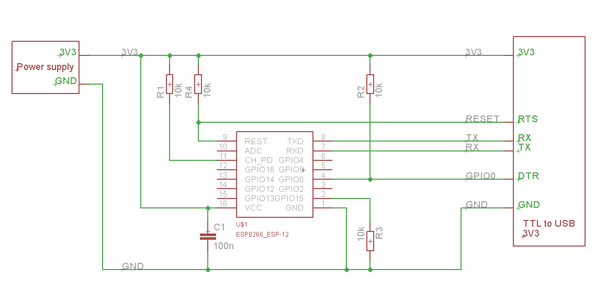

3D Printer ESP8266 Web Interface
================

This one nifty tool lets you use awesome web panel from Duet electronics on any other hardware that supports auxiliary serial connections. And RepRapFirmware. Anyways, it was tested with RADDS and it ~80% works. Use at own risk.

Setup
---
First, you need an ESP8266 module with at least 2MB (Megabytes) of flash. They aren't all the same, even within same model number.
Then, you need to solder it up like this:

Yes, you have to heat up the soldering iron and smell some toxic fumes. If you don't want want that – you can buy a pre-soldered board mentioned on [this page](https://github.com/esp8266/Arduino/blob/master/doc/boards.md) but don't forget that it has to have >= 2MB flash.

Then, you'll need fully functional Arduino IDE for ESP8266. [Arduino for ESP8266](https://github.com/esp8266/Arduino) project has some nice manuals how to set it up. Right on their front page. You have to be able to upload SPIFFS data to it. Do not ignore that part or you'll get constant 404's.

Once you got everything working and blinked some leds you need to clone this repo and copy this repo contents into your sketchbook folder. Then open the ESPRINTER.ino file and upload it to your device. Watch the upload settings! Remember about the >=2MB flash chip? Don't forget to select yours in IDE or it won't upload (and it won't tell you why)! Then select "Tools -> ESP8266 Sketch Data Upload" and wait for upload.

Once you uploaded all that, your module will seek wifi router. It won't find any known hotspots and will start his own named ESPrinter. Connect to it and go to http://192.168.1.1/ in your browser. There will be a list with all the WiFi hotspots and you'll have to select yours and enter the password.
Module will then reboot (if it will not – help it!) and connect to your network.

Then wire up your ESP8266 to your 3d printer auxiliary output. Beware that ESP8266 is powered by 3.3V and supplying 5V (general 3D printer electronics voltage) will instantly release magic smoke (= will kill ESP8266).
If your board does not supply 3.3V you will need a voltage regulator for 3.3v.

Here is a wiring diagram for RADDS board:

If you have a LCD display it will most likely display an IP address on it.

If you have an Apple Mac machine you can just go to http://esprinter.local/

Then, you'll need to change your RepRapFirmware config file.
Add a line to the very bottom of your config.g:

     M575 P1 B115200 S0  ; set aux port to 115200 baud and do not require checksum

Then reboot everything and it will (hopefully) work.

What does not work
-----------

- File uploads
- Macro uploads
- Upload and print
- SD transfer
- Pretty much everything that requires moving files

You can do a pull request and fix those. But unless we have a separate SD on ESP8266 all transfers will be super slow. Like, really, really slow. Even slower than 3G in Canada.

Look, it is easier to say what works on this thing. But for ~$3 you get a speedy wifi for your printer. Great deal, if you ask me!

Modify
----

You need to have node.js installed to minify your js and css. Do the npm install from the data/build folder and then node minify.js – this will create the minified js and css. Do this every time you change anything in CSS or JS.

Credits
------
- Duet web panel was originally developed by Christian Hammacher.

- Arduino for ESP8266 was developed by [these guys](https://github.com/esp8266/Arduino/graphs/contributors)

- RepRapFirmware was developed by Adrian Bowyer, dc42 and dcnewman helped.
